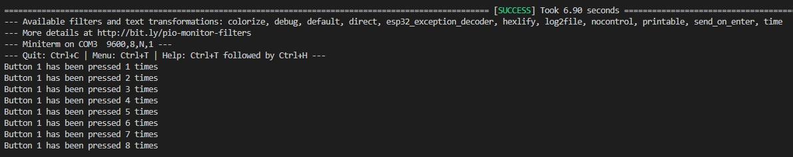

# PRACTICA 2  :  INTERRUPCIONES

## INFORME PARTE A

### Codigo

```#include <Arduino.h>

struct Button {
  const uint8_t PIN;
  uint32_t numberKeyPresses;
  bool pressed;
};
Button button1 = {18, 0, false};

void IRAM_ATTR isr() {
  button1.numberKeyPresses += 1;
  button1.pressed = true;
}
void setup() {
  Serial.begin(9600);
  pinMode(button1.PIN, INPUT_PULLUP);
  attachInterrupt(button1.PIN, isr, FALLING);
}
void loop() {
  if (button1.pressed) {
    Serial.printf("Button 1 has been pressed %u times\n", button1.numberKeyPresses);
    button1.pressed = false;
  }
//Detach Interrupt after 1 Minute
static uint32_t lastMillis = 0;
if (millis() - lastMillis > 60000) {
  lastMillis = millis();
  detachInterrupt(button1.PIN);
  Serial.println("Interrupt Detached!");
  }
}
```

En ejecutar el programa se inicia un contador a 0. Por el terminal se muestra el mensaje Button 1 has been pressed x times, cada vez que se pulsa el pulsador, donde x es el valor de el contador,el cual se incrementa por uno cada vez que se pulsa este.
A continuación  podemos ver el resultado que sale por el terminal una vez apretado el pulsador 8 veces.

<!--Images-->


Al analizar el codigo primero tenemos un struct Button que da información de donde se conecta el boton el valor del contador y si esta presionado o no. 
Se crea un boton conectado al pin 18, con contador a 0 que no esta pulsado. 
Seguidamente tenemos la función IRAM_ATTR que se encarga de incrementaar el valor del contador.
Y por ultimo la función loop se encarga de mostrar por pantalla el mensaje cuando detecta que el boton ha sido pulsado.
