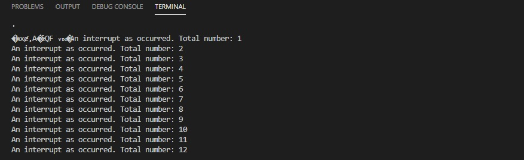

# PRACTICA 2  :  INTERRUPCIONES

## INFORME PARTE B

### Codigo

```
#include <Arduino.h>

volatile int interruptCounter;
int totalInterruptCounter;
 
hw_timer_t * timer = NULL;
portMUX_TYPE timerMux = portMUX_INITIALIZER_UNLOCKED;
 
void IRAM_ATTR onTimer() {
  portENTER_CRITICAL_ISR(&timerMux);
  interruptCounter++;
  portEXIT_CRITICAL_ISR(&timerMux);
 
}
 
void setup() {
 
  Serial.begin(9600);
 
  timer = timerBegin(0, 80, true);
  timerAttachInterrupt(timer, &onTimer, true);
  timerAlarmWrite(timer, 1000000, true);
  timerAlarmEnable(timer);
 
}
 
void loop() {
 
  if (interruptCounter > 0) {
 
    portENTER_CRITICAL(&timerMux);
    interruptCounter--;
    portEXIT_CRITICAL(&timerMux);
 
    totalInterruptCounter++;
 
    Serial.print("An interrupt as occurred. Total number: ");
    Serial.println(totalInterruptCounter);
 
  }
}


```
El que fa aquest programa es mostrar per pantalla el missatge: An interrupt as occurred. Total number: x, cada vegada que es detecta una interrupció. 
Aquest és un exemple de la sortida per terminal:
<!--Images-->


El que fa el codi es el seguent. En el setup s'inicia un temporitzador, aleshores es fa un bucle per quan el contador d'interrupcions es superior a 0, es a dir quan hi ha la primera interrupció, el que fa el loop es incrementar el valor del contador total d'interrupcions per 1. 
Per ultim abans d'acabar el bucle es mostra per pantalla el missatge "An interrupt as occurred. Total number: " i el valor total del contador d'interrupcions.